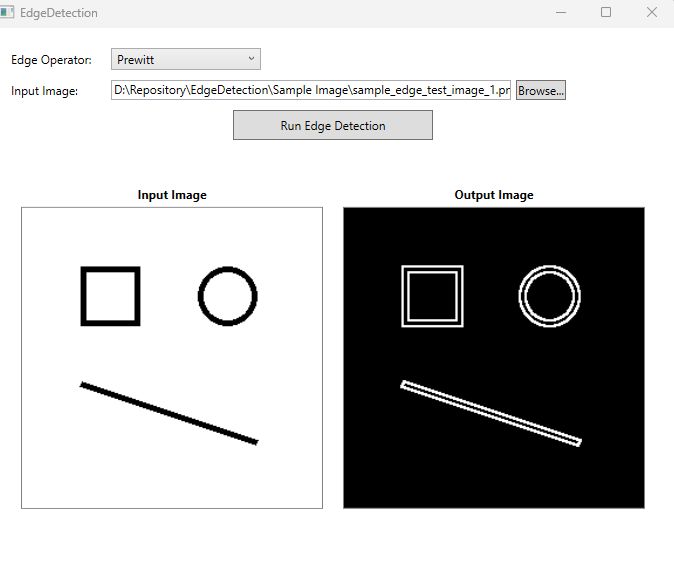
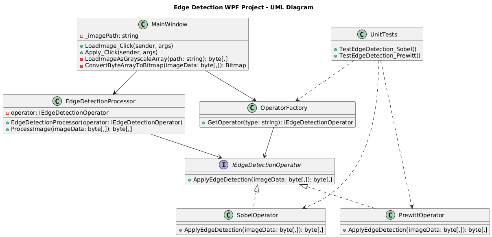

# EdgeDetection
Robust C# framework designed to perform image edge detection using two industry-standard algorithms – the Sobel and Prewitt operators

## 📌 Overview

This project is a C# implementation of an **image edge detection algorithm** using either the **Sobel** or **Prewitt** operator. The user can select the operator type before processing an input grayscale image. The project demonstrates core concepts in image processing, clean architecture, and unit testing in C#.
Target framework .Net 8.0 and Emgu.CV 4.10

---

## 🚀 Features

- Load a grayscale and color image from disk
- Choose between **Sobel** and **Prewitt** edge detection operators
- Apply edge detection and visualize the result
- Display the processed image in UI and save as a new `.bmp` file
- Unit test coverage for operator logic and edge cases

---

## 🧠 Architecture

The project follows an interface-driven architecture:

- `IEdgeDetectionOperator`: Interface for all edge detection operators.
- `SobelOperator` / `PrewittOperator`: Concrete implementations using EMGU CV.
- `EdgeDetectionProcessor`: Accepts any operator and applies it to input.
- `OperatorFactory`: Selects the operator based on user input.
- `MainWindow.xaml`: The WPF GUI for user interaction.

---

## 📘 UML Class Diagram
This UML diagram shows how the Edge Detection WPF application is structured. It includes:
- The `IEdgeDetectionOperator` interface and its implementations.
- A `Processor` that uses the strategy pattern.
- A `MainWindow` UI entry point.
- A `UnitTests` class to ensure logic correctness.

